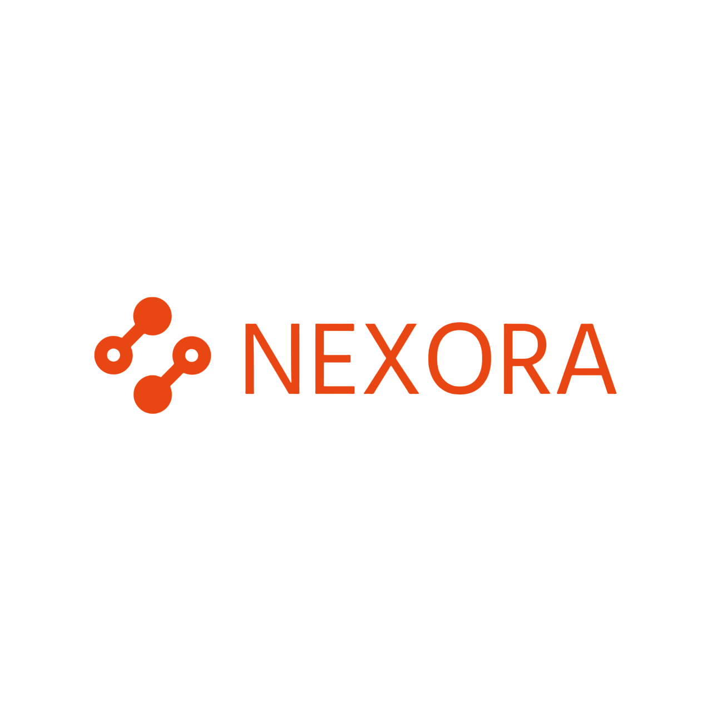

<p align="center">
  
</p>

<h1 align="center">Nexora – AI Chat Assistant</h1>

<p align="center">
  A modern, feature-rich AI chat application built with Flutter, powered by NVIDIA AI models.
</p>

<p align="center">
  
  
  
  
  
</p>

---

## ✨ Features

- **🤖 Multi-Model AI Chat** — Choose from a curated catalog of AI models (GPT, Claude, Gemini, and more) fetched dynamically from Firestore. Switch models on the fly.
- **⚡ Real-Time Streaming Responses** — AI responses stream in token-by-token for a fluid, natural conversation feel.
- **🔐 Secure Authentication** — Email/password sign-up and Google Sign-In, powered by Firebase Auth.
- **💾 Offline-First Architecture** — All chats are stored locally using Hive, so your conversations are always accessible — even without an internet connection.
- **☁️ Cloud Sync** — Seamlessly sync, back up, and restore your chat history between devices using Firebase Firestore.
- **🌗 Light & Dark Themes** — Automatic theme switching based on system preferences, with a polished custom design system.
- **👤 User Profiles** — View and edit your profile, including name, photo, and contact details.
- **📜 Chat History** — Browse, search, and revisit all your past conversations.
- **🎯 Onboarding Flow** — A guided welcome experience for first-time users.
- **🔒 Privacy Policy** — In-app privacy policy viewer via WebView.
- **📤 Share & Export** — Share chat responses with others using the system share sheet.
- **📝 Markdown Rendering** — AI responses are rendered with full Markdown support for code blocks, lists, bold text, and more.

---

## 🏗️ Architecture

Nexora follows a **feature-first, layered architecture** for clean separation of concerns:

```
lib/
├── core/                   # Shared utilities, services, and design system
│   ├── bloc/               # Global BLoC components
│   ├── local_storage/      # Hive storage & SharedPreferences
│   ├── service/            # Firebase services & NVIDIA API client
│   ├── theme/              # App-wide theming (light/dark)
│   ├── utility/            # Dependency injection (GetIt)
│   └── widgets/            # Reusable UI components
├── features/               # Feature modules
│   ├── auth/               # Authentication (login, sign-up, BLoC)
│   ├── chat/               # AI chat (UI, BLoC, models)
│   ├── history/            # Chat history browsing
│   ├── home/               # Home dashboard
│   ├── models/             # AI model catalog & selection
│   ├── onboarding/         # Welcome/onboarding flow
│   ├── profile/            # User profile management
│   ├── settings/           # App settings
│   ├── splash/             # Splash & welcome screens
│   └── sync/               # Cloud sync (upload/restore/merge)
├── routes/                 # GoRouter navigation configuration
└── main.dart               # App entry point
```

---

## 🛠️ Tech Stack

| Layer              | Technology                                                    |
| ------------------ | ------------------------------------------------------------- |
| **Framework**      | Flutter 3.x / Dart 3.8+                                      |
| **State Mgmt**     | flutter_bloc (BLoC pattern) + flutter_riverpod                |
| **Navigation**     | go_router (declarative routing with auth guards)              |
| **AI Backend**     | NVIDIA AI API (streaming chat completions via Dio)            |
| **Authentication** | Firebase Auth (Email/Password + Google Sign-In)               |
| **Cloud Database** | Cloud Firestore (user data, model catalog, chat sync)         |
| **Cloud Storage**  | Firebase Storage (profile images)                             |
| **Local Storage**  | Hive (chat data) + SharedPreferences (settings & preferences) |
| **Networking**     | Dio (HTTP client with streaming support)                      |
| **UI Extras**      | google_fonts, flutter_markdown, image_picker, share_plus      |
| **DI**             | get_it (service locator)                                      |

---

## 🚀 Getting Started

### Prerequisites

- **Flutter SDK** 3.x or higher ([Install Flutter](https://docs.flutter.dev/get-started/install))
- **Dart SDK** 3.8+ (bundled with Flutter)
- A **Firebase project** configured for Android, iOS, and/or Web
- An **NVIDIA AI API key** ([Get one here](https://build.nvidia.com/))

### Installation

1. **Clone the repository**

   ```bash
   git clone https://github.com/MeetVaghela1911/nexora.git
   cd nexora
   ```

2. **Install dependencies**

   ```bash
   flutter pub get
   ```

3. **Configure Firebase**

   If you haven't already, set up Firebase for the project:

   ```bash
   # Install FlutterFire CLI
   dart pub global activate flutterfire_cli

   # Configure Firebase (follow the prompts)
   flutterfire configure
   ```

   This will generate `lib/firebase_options.dart` with your project's configuration.

4. **Set up NVIDIA API Key**

   Update the API key in `lib/core/service/api_service/nvidia_api_service.dart`:

   ```dart
   static const String apiKey = "YOUR_NVIDIA_API_KEY";
   ```

5. **Run Hive code generation** (if needed)

   ```bash
   flutter pub run build_runner build --delete-conflicting-outputs
   ```

6. **Run the app**

   ```bash
   flutter run
   ```

---

## 🔧 Firebase Setup

Nexora uses the following Firebase services — make sure they are enabled in your Firebase Console:

| Service              | Purpose                                     |
| -------------------- | ------------------------------------------- |
| **Authentication**   | Email/Password and Google Sign-In providers |
| **Cloud Firestore**  | User profiles, AI model catalog, chat sync  |
| **Firebase Storage** | Profile image uploads                       |

The Firestore security rules are defined in [`firestore.rules`](firestore.rules) at the project root.

---

## 📱 Supported Platforms

| Platform  | Status |
| --------- | ------ |
| Android   | ✅      |
| iOS       | ✅      |
| Web       | ✅      |
| macOS     | 🔧     |
| Linux     | 🔧     |
| Windows   | 🔧     |

✅ = Fully supported &nbsp;&nbsp; 🔧 = Build target available, not fully tested

---

## 📂 Key Files

| File / Directory                           | Description                          |
| ------------------------------------------ | ------------------------------------ |
| `lib/main.dart`                            | App entry point & initialization     |
| `lib/routes/app_router.dart`               | Route definitions & auth guards      |
| `lib/core/service/api_service/`            | NVIDIA AI API integration            |
| `lib/core/service/auth_service.dart`       | Firebase Auth service                |
| `lib/core/service/firestore_chat_service.dart` | Firestore sync service           |
| `lib/core/local_storage/hive/`             | Hive models & chat storage service   |
| `lib/core/theme/`                          | Light & dark theme configuration     |
| `lib/features/chat/`                       | Chat feature (UI, BLoC, models)      |
| `lib/features/auth/`                       | Auth feature (login, sign-up, BLoC)  |
| `lib/features/sync/`                       | Cloud sync (upload/restore/merge)    |
| `pubspec.yaml`                             | Dependencies & project configuration |
| `firestore.rules`                          | Firestore security rules             |

---

## 🤝 Contributing

Contributions are welcome! Feel free to open issues or submit pull requests.

1. Fork the repository
2. Create your feature branch (`git checkout -b feature/amazing-feature`)
3. Commit your changes (`git commit -m 'Add amazing feature'`)
4. Push to the branch (`git push origin feature/amazing-feature`)
5. Open a Pull Request

---

## 📄 License

This project is proprietary. All rights reserved.

---

<p align="center">
  Built with ❤️ using Flutter
</p>
